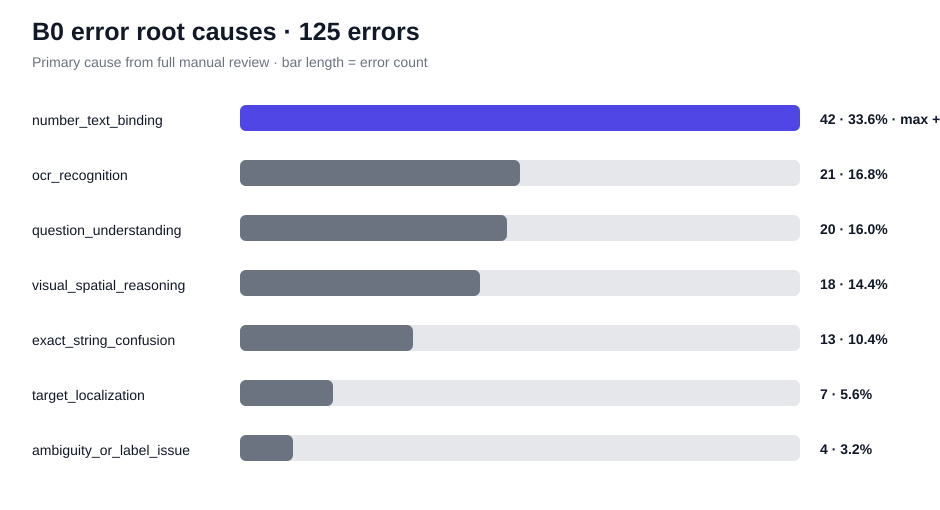

# Modeling Dashboard

> **현재 reference:** Qwen2.5-VL-3B-Instruct + direct prompt + standard (~0.8MP). Random 90.68%, Grouped 91.73%.

## 지금까지의 모델 변화

| Stage | 변경 | Random 결과 | 판단 |
|---|---|---:|---|
| **B0** | direct + ~0.8MP | **90.68%** | Reference |
| A1 | OCR-aware prompt | 90.68% | Reject |
| A2 | max cap ~1.0MP | 90.75% (+1 sample) | Reject as global |
| A2-D | B0 vs A2 paired | 5 wins / 4 losses | High/ensemble 종료 |
| A4 | constrained scoring 사전진단 | 오류 98.4%가 clean one-letter | Full run 생략 |
| **B1** | price+phone binding-aware prompt | TBD | **Next** |

## B0 오답 125개 전수 분석



| Root cause | Errors | Share |
|---|---:|---:|
| **number_text_binding** | **42** | **33.6%** |
| OCR recognition | 21 | 16.8% |
| question understanding | 20 | 16.0% |
| visual/spatial reasoning | 18 | 14.4% |
| exact-string confusion | 13 | 10.4% |
| target localization | 7 | 5.6% |
| ambiguity/label | 4 | 3.2% |

Reasoning/association 계열(binding + question understanding + spatial)이 **64%**다.

### 가장 중요한 발견

- price 오답 **22/22 = binding**
- phone 오답 **7/7 = binding**

즉 현재 첫 병목은 “숫자를 못 읽는다”보다 **“질문의 대상과 올바른 숫자를 연결한다”**에 가깝다.

## 다음 실험: B1

```text
val_random
   ↓
price + phone만 추출 (223)
   ↓
B0 direct            B1 binding-aware
   │                       │
   └──── paired comparison ┘
              ↓
      wrong→right / right→wrong
      net gain / McNemar
```

B0 subset:
- **194 / 223 correct**
- **87.00%**
- errors **29**

B1은 model, resolution, seed, decoding을 그대로 두고 **prompt만 변경**한다.

### 성공 기준

**net +5 samples 이상**

+5는 전체 validation 기준 약 **+0.37pp**에 해당한다.

- +0~2 → Reject
- +3~4 → 신호는 있으나 추가 근거 필요
- **+5 이상 → grouped price+phone confirmation**

## 실패하면

prompt를 계속 미세조정하지 않는다.

다음은 **B2 layout-aware grounding**:
- target crop / zoom
- OCR + bbox
- same-row / nearest-value 구조

그 이후에도 binding/reasoning이 남으면 QLoRA를 검토한다.

## Validation 원칙

Random split은 반복 실험에 사용되었으므로 **development/tuning set**으로 취급한다.

Grouped split은 candidate가 생겼을 때만 쓰는 **confirmation set**으로 아껴 둔다.


## B1 결과

| Metric | Result |
|---|---:|
| B0 price+phone | 194 / 223 (**87.00%**) |
| B1 price+phone | 196 / 223 (**87.89%**) |
| Wrong→Right | **2** |
| Right→Wrong | **0** |
| Net gain | **+2** |
| McNemar exact p | **0.50** |

사전 gate였던 **net +5**를 넘지 못했다.

따라서:
- B1 채택 안 함
- grouped 확인 안 함
- prompt 미세조정 중단

다만 A2 high-resolution도 phone +1, price +1이었다.

### 다음은 GPU 없이 확인

**A2와 B1이 같은 2개를 고쳤는지 확인한다.**

- same fixes → prompt/high-res 둘 다 종료 → B2 layout grounding
- different fixes → complementarity 가능 → 작은 조합 실험 검토


## A2 vs B1: 점수는 같지만 고친 문제가 다르다

A2와 B1은 둘 다 price+phone에서 **196/223 = 87.89%**였지만 prediction은 4개 달랐다.

- A2만 맞음: **2**
- B1만 맞음: **2**
- 둘 다 맞음: **194**
- 둘 다 틀림: **25**

즉 B0에서 A2가 회수한 2개와 B1이 회수한 2개가 **서로 다른 sample**이다.

### 다음: 2×2 실험의 마지막 칸

| | direct | binding |
|---|---:|---:|
| standard | B0 194 | B1 196 |
| high | A2 196 | **B1C ?** |

이제 **high + binding**만 테스트하면 된다.

Gate:
- **198+** → additive 가능, grouped confirmation
- 197 → 약한 신호
- **196 이하** → 결합 가치 없음, B2 layout grounding으로 이동


## B1C 결과: 2×2 마지막 칸 성공

| | direct | binding-aware |
|---|---:|---:|
| standard | B0 **194** | B1 **196** |
| high | A2 **196** | **B1C 198** |

B1C는 B0 대비 **+4, regression 0**이었다.

더 중요한 점은 A2와 B1이 각각 고친 서로 다른 2개씩을 B1C가 **전부 보존**했다는 것이다.

즉 random price+phone subset에서:
- A2 효과 +2
- B1 효과 +2
- 결합 B1C +4

로 additive pattern이 관찰됐다.

다만 McNemar p=0.125이고 random split은 tuning에 반복 사용되었으므로 최종 채택은 아직 아니다.

### 다음: grouped confirmation

Grouped B0 price+phone baseline:
- **202 / 223 = 90.58%**

사전 gate:
- **206+** → strong replication
- **204–205** → directional replication
- **203 이하** → not confirmed

Grouped에서는 B1C만 한 번 확인하고, 결과를 본 뒤 selective routing 또는 B2 layout grounding으로 분기한다.


## Grouped confirmation 결과

B1C grouped:
- **205 / 223 = 91.93%**
- B0 grouped: 202 / 223
- net **+3**
- wins 6 / losses 3

사전 gate상 **directional replication**이지만 strong replication은 아니다.

더 중요한 건 category가 갈렸다.

| Category | Random B1C vs B0 | Grouped B1C vs B0 |
|---|---:|---:|
| **price** | **+2** | **+4** |
| phone | +2 | **-1** |

따라서 현재 후보는 **price-only selective routing**이다.

관측상 price-only hybrid는:
- Random full: **90.83%** (+0.15 pp)
- Grouped full: **92.03%** (+0.30 pp)

하지만 이 rule은 grouped 결과를 본 뒤 정제됐으므로 바로 최종 채택하면 안 된다.

### 다음: fresh audit holdout

기존 random/grouped validation ID를 모두 제외한 train pool에서:
- price 200
- phone 100

을 새로 뽑아 B0와 B1C를 한 번씩만 비교한다.

여기서 price 효과가 다시 positive면 price-only routing을 lock하고, 이후 B2는 residual price/scene-text errors를 대상으로 진행한다.


## Fresh audit split 생성 완료

기존 random/grouped validation ID를 모두 제외하고 새 audit을 만들었다.

- untouched pool: **4,294**
- audit: **300**
  - price 200
  - phone 100

이제 같은 300개에 딱 두 설정만 실행한다:

1. B0 = standard + direct
2. B1C = high + binding-aware

**결과를 본 뒤 prompt나 threshold를 바꾸지 않는다.**

Price decision gate:
- **net +4 이상 + regressions <=2** → price-only routing 후보 유지
- +2~3 → 약한 재현
- <=+1 → routing branch 종료

이 audit 300개는 이후 QLoRA 학습 데이터에서도 제외한다.


## Fresh audit: price-only routing 통과

Fresh untouched audit 결과:

| Category | B0 | B1C | Net |
|---|---:|---:|---:|
| **price (200)** | 90.0% | **92.0%** | **+4** |
| phone (100) | 89.0% | 87.0% | **-2** |

Price는 사전 gate인 **net +4, regressions <=2**를 정확히 통과했다.

따라서 현재 locked candidate:

```text
price → high + binding-aware
others → standard + direct
```

이 route를 적용한 full validation 관측값:
- Random: **90.68 → 90.83%**
- Grouped: **91.73 → 92.03%**

Fresh audit의 price McNemar p=0.21875라 통계적 확정이라고 표현하지는 않는다. 대신 **사전 실용 gate를 독립 audit에서 통과했고 기존 두 validation에서도 같은 방향**이라고 기록한다.

다음 실험은 이 audit을 더 만지지 않고 별도 dev pool에서 진행한다.


## 다음 전략: B2-D scene-text grounding

Price router는 이제 **freeze**한다. Audit도 다시 보면서 튜닝하지 않는다.

다음으로 가장 큰 남은 기회는 scene_text다.

Scene-text B0 오답 59개 중:
- OCR recognition 21
- exact-string confusion 11
- target localization 3

즉 **35개(59.3%)가 perception/grounding 계열**이다.

기존 A1/A2처럼 "더 잘 읽어라" 또는 global max-resolution을 조금 올리는 실험은 이미 효과가 없었다.

그래서 B2-D는 구조를 바꾼다:

```text
full image
+ four overlapping zoom crops
        ↓
choice logits per view
        ↓
full evidence + strongest crop evidence
        ↓
a / b / c / d
```

먼저 70개 diagnostic만 사용:
- perception error 35
- correct control 35

Gate:
- **8개 이상 rescue + control regression 3개 이하** → full scene_text run
- 아니면 tiling branch 종료

이렇게 해야 GPU 시간을 큰 full run 전에 mechanism 검증에만 쓴다.
