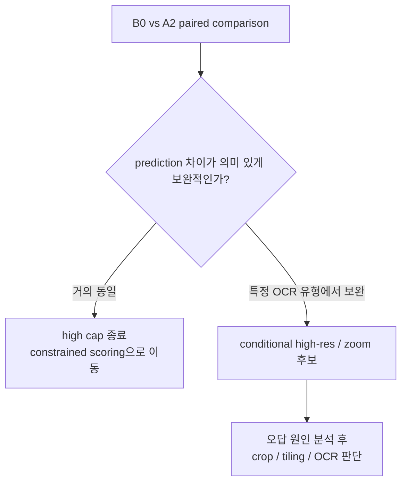

# Modeling Dashboard

> **현재 best:** Qwen2.5-VL-3B-Instruct + direct prompt + standard (~0.8MP). A2 high cap은 +1문제뿐이라 global 설정으로는 채택하지 않는다.

## 지금까지

| Stage | 변경 | Random | 변화 | 결정 |
|---|---|---:|---:|---|
| **B0** | direct + ~0.8MP | **90.68%** | 기준 | **Current best/reference** |
| A1 | OCR-aware prompt | **90.68%** | 0.00 pp | Reject |
| A2 | max cap ~0.8 → ~1.0MP | **90.75%** | +0.07 pp / +1문제 | 보류/Reject as global |


## A2에서 중요한 점

A2를 보고 **"해상도는 중요하지 않다"**고 결론 내리면 안 된다.

EDA 이미지 중앙값은 약 0.69MP이고 standard cap은 약 0.80MP다.

즉 high의 1.0MP 설정은 모든 이미지를 확대하는 게 아니라, 큰 이미지의 downsampling을 조금 덜 하는 실험이다.

측정 결과:

- Overall **+0.07 pp**
- OCR-heavy **+0.11 pp**
- phone **+2.33 pp**
- price **+0.56 pp**
- scene_text **-0.15 pp**
- runtime **+2.74%**

현재 근거만으로 추가 비용을 감수할 이유가 없다.

## 지금 가장 전략적인 다음 행동

새 모델 추론을 바로 돌리지 않는다.

먼저 이미 있는 두 prediction 파일을 비교한다.

```text
B0 standard
vs
A2 high
```

확인:
- wrong → right
- right → wrong
- disagreement rate
- 바뀐 샘플의 category

이 결과로 다음을 결정한다.



## 원칙

**GPU 시간을 쓰기 전에 기존 결과에서 최대한 정보를 뽑는다.**

이 프로젝트의 목표는 많은 실험이 아니라 **정보 효율이 높은 실험 순서**다.
