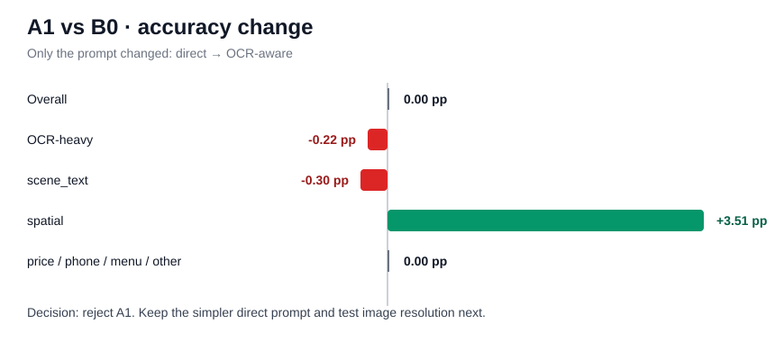
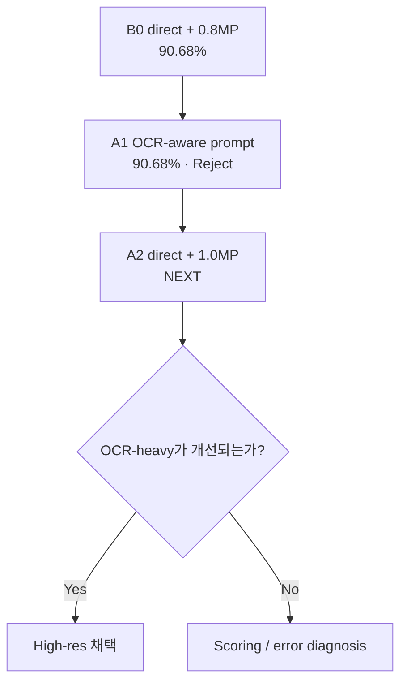

# Modeling Dashboard

> **현재 상태:** B0는 90.68%의 강한 zero-shot baseline. A1 OCR-aware prompt는 개선이 없어 폐기했다. 다음은 **A2: 해상도만 ~1.0MP로 증가**한다.

## 지금까지 한눈에 보기

| Stage | 변경 | Random acc. | Δ vs B0 | 결정 |
|---|---|---:|---:|---|
| **B0** | Qwen2.5-VL-3B + direct + ~0.8MP | **90.68%** | 기준 | Keep |
| **A1** | prompt만 OCR-aware로 변경 | **90.68%** | **0.00 pp** | **Reject** |
| **A2** | resolution만 ~1.0MP로 변경 | TBD | TBD | **Next** |

## A1에서 배운 점

"텍스트를 더 꼼꼼히 보라"는 지시만으로는 OCR-heavy 오류가 줄지 않았다.

- OCR-heavy: **89.91% → 89.70%**
- scene_text: **91.17% → 90.87%**
- overall: **변화 없음**
- runtime: **약 +1.6%**

따라서 현재 best는 여전히:

| 항목 | 값 |
|---|---|
| Model | **Qwen2.5-VL-3B-Instruct** |
| Prompt | **direct** |
| Resolution | **standard ~0.8MP** |
| Decision | free generation |
| Random | **90.68%** |
| Grouped | **91.73%** |

## 다음 전략

### A2의 질문

> 작은 글자 자체가 충분히 보이지 않는 것이 병목인가?

고정:
- model
- direct prompt
- seed
- generation

변경:
- **standard → high resolution**

실험은 항상 **한 질문에 하나의 변수**만 바꾼다.
