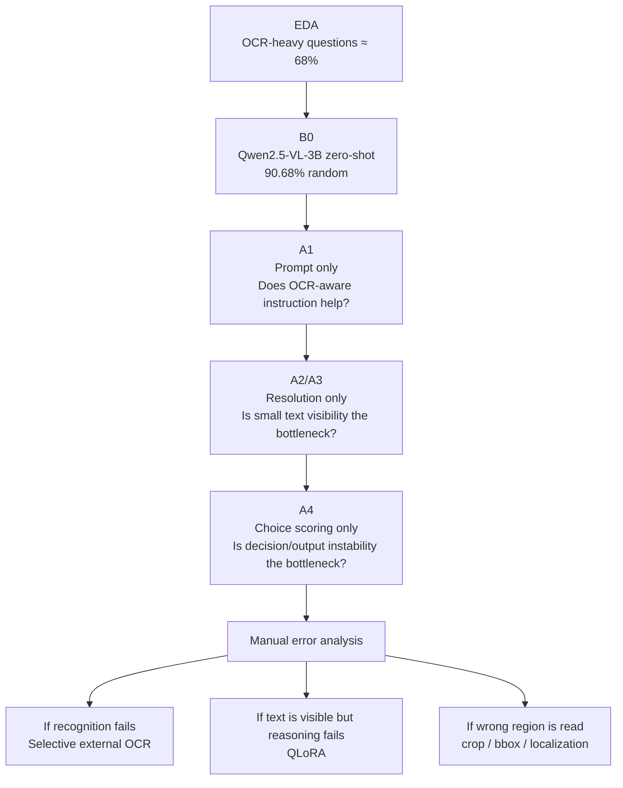

# Modeling Dashboard

> **Current status:** Strong zero-shot baseline established. The next experiment changes only the prompt to test whether OCR-aware instruction improves text-heavy questions.

## Current best-known baseline

| Item | Value |
|---|---|
| Model | **Qwen2.5-VL-3B-Instruct** |
| Strategy | Zero-shot multimodal inference |
| Prompt | Direct multiple-choice |
| Resolution | Dynamic, max ~0.8MP |
| Random validation | **90.68%** |
| Grouped validation | **91.73%** |
| OCR-heavy random accuracy | **89.91%** |
| GPU | RTX 5060 Ti 16GB |
| Next experiment | **A1: OCR-aware prompt ablation** |

## Why we are not fine-tuning yet

The dataset analysis showed that about **68%** of questions are scene-text / price / phone / menu related.

In B0, those OCR-heavy categories account for **74.4% of all random-validation errors**.

That means the most valuable next question is:

> Is the model failing because it does not inspect text carefully enough, because the image resolution is insufficient, or because it reads the text but reasons incorrectly?

We answer those possibilities one at a time.

## Improvement strategy

## What the baseline is weak at

The lowest random-validation accuracies are:

- phone: **83.72%**
- menu: **83.87%**
- spatial: **84.21%**
- price: **87.78%**

However, scene_text has the largest absolute error count because it contains far more samples.

So experiments are selected using both:

1. **accuracy weakness**, and
2. **number of errors that can realistically be recovered**.

## Decision discipline

Every experiment must answer one question.

We do **not** change prompt + resolution + OCR + fine-tuning together.

A change is adopted only when we can explain:

- what changed
- how much the score changed
- which samples/categories changed
- whether the gain survives grouped validation
- what new bottleneck becomes visible

## Portfolio view

This project is intentionally documented as an ML decision process:

**data inspection → validation design → baseline → controlled ablation → error diagnosis → targeted improvement**

See:

- [Model evolution](model_evolution.md)
- [Modeling strategy](modeling_strategy.md)
- [B0 experiment report](experiments/B0_zero_shot_baseline.md)
- [Ablation plan](../experiments/ablation_plan.md)
- [Experiment reporting standard](../experiments/reporting_standard.md)
