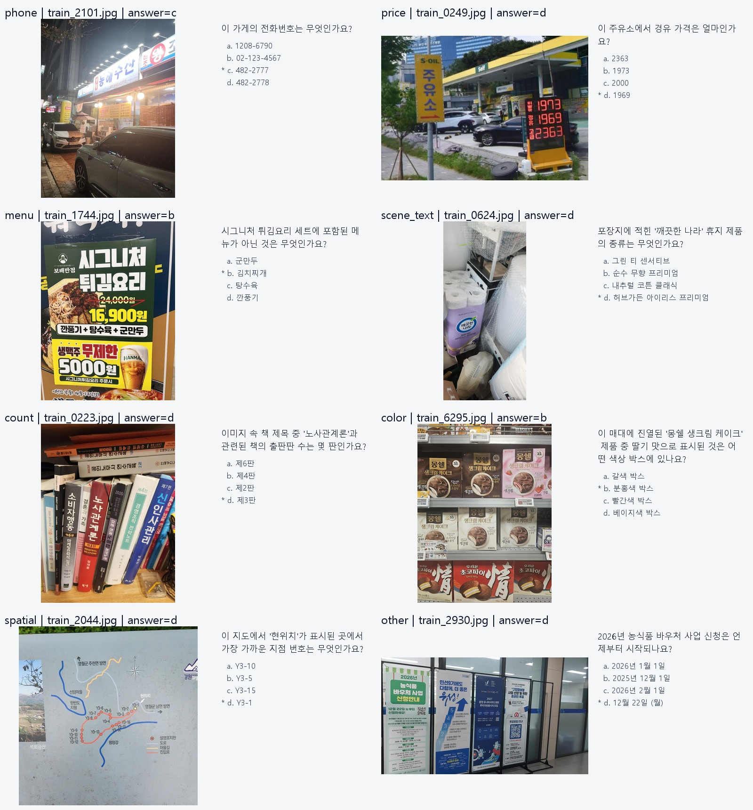

# EDA 결과

분석일: 2026-09-21  
원본: `data/train.csv`, `data/dev.csv`, `data/test.csv`, `data/sample_submission.csv`와 각 이미지 폴더

## 데이터 무결성

| split | CSV 행 | 이미지 | 중복 id | 누락 이미지 | 손상 이미지 |
|---|---:|---:|---:|---:|---:|
| train | 6,714 | 6,714 | 0 | 0 | 0 |
| dev | 2,683 | 2,683 | 0 | 0 | 0 |
| test | 6,714 | 6,714 | 0 | 0 | 0 |

`sample_submission.csv`는 6,714행이며 test id와 같은 규모입니다. train 정답은 a 1,700, b 1,644, c 1,716, d 1,654로 거의 균형입니다.

## 질문과 OCR 성격

질문 문구를 보수적인 규칙으로 분류했습니다. `scene_text + price + phone + menu`를 직접적인 OCR 의존형으로 보면 train 4,613행(68.7%), test 4,544행(67.7%)입니다.

| 유형 | train | dev | test |
|---|---:|---:|---:|
| scene_text | 3,339 | 1,108 | 3,326 |
| price | 898 | 388 | 865 |
| phone | 217 | 90 | 194 |
| menu | 159 | 126 | 159 |
| spatial | 287 | 146 | 295 |
| count | 52 | 17 | 37 |
| color | 15 | 9 | 22 |
| other | 1,747 | 799 | 1,816 |

표본에서는 다음 난점이 반복되었습니다.

- 야간 간판의 과노출과 작은 전화번호
- 가격판의 여러 숫자 중 질문이 가리키는 항목 선택
- 메뉴·포스터의 다단 텍스트와 작은 글자
- 세로형 720×960 이미지에서 멀리 있는 글자
- 동일 이미지 안의 여러 간판·문구 중 정확한 대상 찾기

따라서 384×384 고정 축소는 중요한 글자를 잃을 가능성이 큽니다. 원본 종횡비를 유지하는 Qwen 동적 해상도에서 약 0.8MP(`standard`)를 먼저 측정하고, OCR 유형에서만 약 1.0MP(`high`)가 주는 이득과 처리 시간을 비교합니다.

## 이미지 분포

모든 이미지는 RGB JPEG입니다. 중앙값은 세 split 모두 720×960, 약 0.69MP입니다. 세 split의 크기와 종횡비 분포가 매우 유사합니다.

| split | 세로형 | 정사각형 근처 | 가로형 | 파일 중앙값 |
|---|---:|---:|---:|---:|
| train | 71.8% | 3.1% | 25.1% | 104.8KB |
| dev | 71.3% | 3.5% | 25.2% | 109.1KB |
| test | 71.8% | 3.5% | 24.7% | 104.2KB |

파일 SHA-256 기준 중복 이미지 그룹은 45개이며, 그중 split을 넘는 그룹은 31개입니다. train-test 24개, train-dev 3개, dev-test 4개입니다. 지각 해시 기준 cross-split 그룹은 38개입니다. 규모는 작지만 validation에서는 동일 이미지가 양쪽에 들어가지 않도록 통제합니다.

## 질문 중복과 validation 누출

- test의 888행(13.23%)은 train에서 완전히 같은 정규화 질문 문장을 사용합니다.
- 숫자를 `<num>`으로 치환한 템플릿 기준으로는 test 903행(13.45%)이 train 템플릿과 겹칩니다.
- train 안에서도 같은 질문 템플릿이 반복됩니다. 가장 큰 템플릿 그룹은 62행입니다.

random split은 대회 분포와 가까운 주 지표로 유지합니다. 다만 반복 템플릿 덕분에 점수가 낙관적일 수 있으므로, 정규화 질문 템플릿 또는 동일 이미지 SHA-256을 공유하는 행을 하나의 연결 그룹으로 묶은 grouped split을 함께 사용합니다. 두 점수 차이가 크면 prompt 암기·데이터 누출 민감도가 높다는 뜻입니다.

## dev 응답 구조

- 유효 응답 수: 5개 2,287행, 4개 364행, 3개 30행, 0개 2행
- 최다 동의 수: 3개 2,026행, 2개 649행, 1개 6행, 0개 2행
- 최다 득표 동률: 465행
- 4개 이상 일치: 0행
- 존재하는 응답끼리 완전 일치: 17행

응답 구조가 자연스러운 독립 라벨러 합의와 다르고, exact-image train-dev 비교도 표본이 3쌍뿐이며 유사 질문 한 쌍에서 다수 응답이 train 정답 텍스트와 불일치했습니다. dev는 당분간 정답 없는 진단 세트로만 보관합니다.

## 첫 baseline 결정

첫 baseline은 로컬에 이미 준비된 `Qwen2.5-VL-3B-Instruct` zero-shot입니다.

1. `direct + standard`를 random/grouped validation에 실행합니다.
2. 모델과 해상도를 고정하고 `ocr_deliberate` prompt만 비교합니다.
3. 더 좋은 prompt를 고정하고 `low/standard/high` 해상도를 비교합니다.
4. 유형별 오류를 보고 OCR 전용 결합 여부를 결정합니다.
5. 그 뒤에만 LoRA/QLoRA를 검토합니다.

기존 LoRA 실습 노트북은 200개만 사용하고, 검증 accuracy 없이 loss만 계산하며, prompt 전체를 label로 복사합니다. 대회용 학습 출발점으로 쓰지 않고 참고 자료로 보존합니다.

