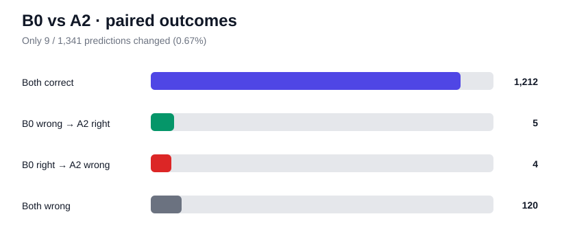

# A2-D — B0 vs A2 Paired Diagnostic

Date: 2026-09-21

## 한눈에 보기

| 항목 | 결과 |
|---|---:|
| 비교 | B0 standard vs A2 high |
| 전체 샘플 | 1,341 |
| Prediction이 바뀐 샘플 | **9 (0.67%)** |
| B0 오답 → A2 정답 | **5** |
| B0 정답 → A2 오답 | **4** |
| Net gain | **+1** |
| 둘 다 정답 | 1,212 |
| 둘 다 오답 | **120** |
| Exact McNemar p-value | **1.00** |
| 결론 | **high cap은 global/ensemble 후보로 약함** |

> **핵심:** A2의 +1문제는 5개를 새로 맞히고 4개를 새로 틀린 결과다. 전체 prediction의 99.33%가 동일했고, paired test에서도 개선 근거가 없다.

## 왜 paired comparison을 했나?

A2 aggregate score는 B0보다 +0.07pp 높았다.

하지만 +1문제만으로는 다음 두 경우를 구분할 수 없다.

1. high-resolution이 거의 아무것도 바꾸지 않았다.
2. 많은 문제를 고치지만 동시에 많은 문제를 망쳐 net +1이 됐다.

두 경우의 modeling 전략은 완전히 다르기 때문에 sample-level 비교가 필요했다.

## 결과

### 전체

| Outcome | Samples |
|---|---:|
| 둘 다 정답 | 1,212 |
| **B0 오답 → A2 정답** | **5** |
| **B0 정답 → A2 오답** | **4** |
| 둘 다 오답 | **120** |

Prediction disagreement rate: **0.67% (9 / 1,341)**

### Category별 변화

| Category | Wrong→Right | Right→Wrong | Net | Disagreement |
|---|---:|---:|---:|---:|
| scene_text | 3 | 4 | **-1** | 1.05% |
| phone | 1 | 0 | **+1** | 2.33% |
| price | 1 | 0 | **+1** | 0.56% |
| menu | 0 | 0 | 0 | 0% |
| spatial | 0 | 0 | 0 | 0% |
| other | 0 | 0 | 0 | 0% |

**바뀐 9개 prediction은 모두 OCR-heavy 유형에 속했다.**

## 통계적 해석

Discordant pair는 9개뿐이다.

- B0만 맞음: 4
- A2만 맞음: 5

Exact McNemar test의 two-sided p-value는 **1.00**이다.

즉 현재 validation에서는 high cap의 우위라고 볼 통계적 근거가 없다.

## Ensemble / routing 가능성

B0와 A2 중 정답인 쪽을 매번 완벽하게 고르는 oracle이 있다고 가정해도:

- Oracle correct: 1,221 / 1,341
- Oracle accuracy: 약 **91.05%**
- B0 대비 이론적 최대 이득: 약 **+0.37pp**

하지만 실제로는 어느 쪽이 맞는지 미리 알 수 없고 두 모델이 99.33% 동일한 prediction을 낸다.

따라서 B0 + A2를 단순 ensemble하는 것은 기대 이득이 매우 작다.

phone/price에서 각각 1개씩 순이득이 있었지만 표본이 너무 작아 **"phone/price면 high를 사용"** 같은 rule을 같은 validation에서 바로 채택하면 overfitting 위험이 크다.

## 중요한 발견

high cap이 prediction을 바꾼 9개가 모두 OCR-heavy였다는 점은 의미가 있다.

즉 resolution은 완전히 무관한 것이 아니라 **일부 텍스트 문제에만 영향을 준다.**

다만 full-image max cap을 0.8→1.0MP로 올리는 방식은 효과가 너무 약하다.

이 결과는 나중에 다음 전략을 검토할 근거가 된다.

- target crop
- tiling
- explicit zoom/upscaling
- OCR bbox 기반 확대

즉 **전체 이미지를 조금 더 크게 넣는 것보다, 필요한 텍스트 영역을 실제로 확대하는 쪽**이 더 타당한 다음 시각 전략이다.

## 결정

1. **A2 high를 global default로 채택하지 않는다.**
2. **B0+A2 ensemble도 진행하지 않는다.**
3. Low-resolution A3는 당장 점수 개선 목적에서는 우선순위를 낮춘다.
4. 다음 high-information experiment는 **choice decision/scoring** 쪽으로 이동한다.
5. crop/tiling/OCR은 remaining-error analysis에서 recognition/localization 문제가 확인되면 다시 진입한다.

## 다음 단계

### A4 pre-check — choice tokenization diagnostic

Generation은 parse failure가 0이지만, multiple-choice task에서는 free generation보다 choice logit/scoring이 더 안정적인지 확인할 가치가 있다.

먼저 GPU 실험 전에 tokenizer에서 a/b/c/d가 실제로 어떻게 tokenization되는지 확인한다.

그 결과를 보고:
- single-token label scoring
- multi-token sequence scoring

중 올바른 구현을 선택한다.

## 포트폴리오 포인트

- aggregate +0.07pp를 그대로 "개선"으로 과장하지 않음
- paired sample analysis로 5 wins / 4 losses 구조를 확인
- McNemar test로 작은 차이를 검증
- 거의 동일한 두 pipeline을 불필요하게 ensemble하지 않음
- resolution 결과를 crop/zoom 가설로 더 정교하게 발전시킴
