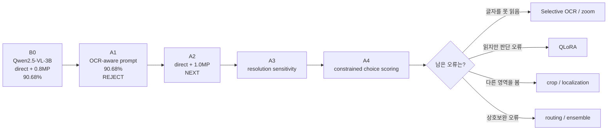

# Model Evolution

모델이 **어떻게, 왜 바뀌었는지**를 시간 순서대로 기록한다.

## 현재 전략 흐름

## 실험 진행표

| Stage | Pipeline | 한 가지 변경 | Random | Grouped | 결과 |
|---|---|---|---:|---:|---|
| **B0** | Qwen2.5-VL-3B + direct + 0.8MP + generation | 최초 zero-shot baseline | **90.68%** | **91.73%** | 기준점 |
| **A1** | 동일 모델 + OCR-aware prompt + 0.8MP | **prompt만 변경** | **90.68%** | 생략 | **Reject** |
| **A2** | 동일 모델 + direct + 1.0MP | **resolution만 변경** | TBD | TBD | **Next** |
| A3 | winning setup | resolution sensitivity | TBD | TBD | Pending |
| A4 | best prompt/resolution | generation → constrained scoring | TBD | TBD | Pending |
| A5 | best VLM setup | selective OCR / zoom | TBD | TBD | Conditional |
| A6 | best inference setup | zero-shot → QLoRA | TBD | TBD | Conditional |

## B0 — 강한 zero-shot 기준점

- Model: **Qwen2.5-VL-3B-Instruct**
- Prompt: direct
- Resolution: ~0.8MP
- Random: **90.68%**
- Grouped: **91.73%**
- OCR-heavy random: **89.91%**
- Parse failure: **0**

핵심 발견: random validation 오답 125개 중 **93개(74.4%)**가 OCR-heavy 유형.

## A1 — OCR-aware prompt

### 변경
Prompt 하나만:
`direct → ocr_deliberate`

### 결과
- Overall: **90.68% → 90.68% (0.00 pp)**
- OCR-heavy: **89.91% → 89.70% (-0.22 pp)**
- scene_text: **91.17% → 90.87% (-0.30 pp)**
- spatial: **84.21% → 87.72% (+3.51 pp)**
- runtime: 약 **+1.6%**

### 판단
**Reject.** 더 긴 OCR-aware prompt는 비용만 늘고 전체/OCR-heavy 성능을 개선하지 못했다.

### 다음
**A2: direct prompt 유지 + high (~1.0MP) resolution.**

---

최종 목표는 기법을 많이 붙이는 것이 아니라, **각 성능 변화의 이유가 설명 가능한 pipeline**을 만드는 것이다.
