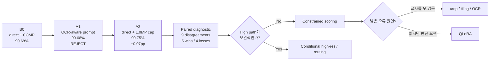

# Model Evolution

모델이 **어떻게, 왜 바뀌었는지**를 시간 순서대로 기록한다.

## 현재 전략 흐름



## 실험 진행표

| Stage | Pipeline | 한 가지 변경 | Random | Grouped | 결정 |
|---|---|---|---:|---:|---|
| **B0** | Qwen2.5-VL-3B + direct + ~0.8MP | baseline | **90.68%** | **91.73%** | 기준점 |
| **A1** | same + OCR-aware prompt | prompt | **90.68%** | 생략 | **Reject** |
| **A2** | same + ~1.0MP max cap | resolution cap | **90.75%** | 생략 | **보류/Reject as global** |
| **A2-D** | B0 vs A2 prediction comparison | no inference | **5 wins / 4 losses** | - | **High/ensemble 종료** |
| **A4** | B0 setup | constrained choice scoring | TBD | TBD | **Next** |
| A5 | targeted visual/OCR path | crop/tiling/OCR | TBD | TBD | Conditional |
| A6 | best inference setup | QLoRA | TBD | TBD | Conditional |

## B0

- Model: **Qwen2.5-VL-3B-Instruct**
- direct prompt
- standard max ~0.8MP
- Random **90.68%**
- Grouped **91.73%**

## A1 — OCR-aware prompt

- Overall: **90.68% → 90.68%**
- OCR-heavy: **89.91% → 89.70%**
- Decision: **Reject**

프롬프트에서 OCR을 강조하는 것만으로는 개선되지 않았다.

## A2 — High max-resolution cap

- Overall: **90.68% → 90.75% (+0.07 pp)**
- Correct: **+1**
- OCR-heavy: **+0.11 pp**
- phone: **+2.33 pp**
- price: **+0.56 pp**
- scene_text: **-0.15 pp**
- Runtime: **+2.74%**


### 판단

**Global default로는 채택하지 않는다.**

+1문제는 실질적 개선이라고 보기 어렵다.

또한 max_pixels 증가 자체는 모든 이미지를 업스케일하지 않는다. 중앙 이미지 크기가 약 0.69MP이므로 standard 0.8MP cap 이하 이미지는 high 설정에서도 새 시각 정보가 생기지 않는다.

### 다음

새 GPU run 전에 **B0와 A2의 sample-level prediction 변화**를 분석한다.

목표는 high path가 단순 noise인지, 특정 샘플에서 상호보완적인지 판단하는 것이다.


## A2-D — Paired diagnostic

- Prediction disagreement: **9 / 1,341 (0.67%)**
- B0 wrong → A2 right: **5**
- B0 right → A2 wrong: **4**
- Net gain: **+1**
- Exact McNemar p-value: **1.00**
- Both wrong: **120**

바뀐 9개 prediction은 모두 OCR-heavy category였다.

### 판단

High cap은 global improvement도 아니고 ensemble partner로도 너무 유사하다.

다만 resolution이 일부 OCR-heavy sample에만 영향을 준다는 단서는 얻었다. 따라서 나중에 시각 정보를 더 쓰게 된다면 full-image high cap보다 **target crop / tiling / zoom**을 우선 검토한다.

### 다음

**A4 choice-scoring pre-check.** 먼저 a/b/c/d tokenization을 확인하고 올바른 scoring 구현을 선택한다.


## A4-P0 — Choice-token pre-check

Qwen tokenizer를 확인한 결과:

```text
a -> id 64
b -> id 65
c -> id 66
d -> id 67
```

assistant-generation context에서도 모두 **1 token**이다.

따라서 constrained choice scoring은 구현상 단순하다.

하지만 현재 greedy generation이 이미 모든 sample에서 정확히 한 글자 a/b/c/d를 출력한다면 next-token constrained scoring은 동일한 prediction을 만들 수밖에 없다.

### 다음

GPU run 전에 `raw_output` exact-one-letter 비율을 검사한다.

**전략:** scoring 기법을 구현할 수 있다는 이유만으로 실험하지 않는다. 실제로 prediction을 바꿀 가능성이 있는지 먼저 확인한다.


## A4-P1 — Generation-format diagnostic

B0 raw outputs:

- exact one-letter: **1,240 / 1,341 (92.47%)**
- non-exact: **101 / 1,341 (7.53%)**
- non-exact but choice-like: **101 / 101**
- parse failure: **0**

### 해석

Parser 문제는 아니다.

하지만 `(d)`처럼 첫 token이 괄호일 수 있는 101개에서는 constrained a/b/c/d logits가 현재 parsed answer와 달라질 가능성이 있다.

### 결정

전체 scoring run 전에 **101개 non-exact subset의 현재 accuracy/category를 CPU로 분석**한다.

그 subset이 실제로 취약하다면 그때 101개만 targeted scoring하여 정보 대비 GPU 비용을 최소화한다.


## A4-P2 — Exact vs non-exact accuracy

- exact one-letter: **1,240개, 90.08%, 123 errors**
- non-exact: **101개, 98.02%, 2 errors**
- 전체 오류 125개 중 **123개(98.4%)**가 exact output에서 발생

### 판단

Output formatting / parsing / constrained scoring은 핵심 병목이 아니다.

**A4 full scoring run은 생략한다.**

### 다음

B0의 125개 오류를 root cause로 분류한다.

결과에 따라:
- OCR recognition → crop/tiling/OCR
- localization → region-focused inference
- binding/reasoning → QLoRA
- mixed → routing

으로 분기한다.
