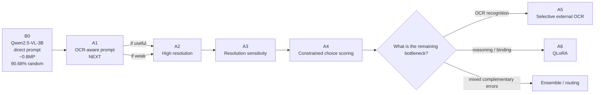
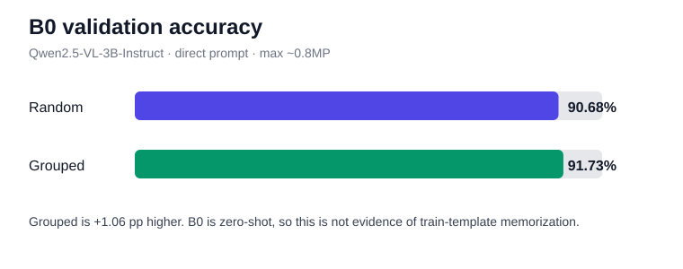
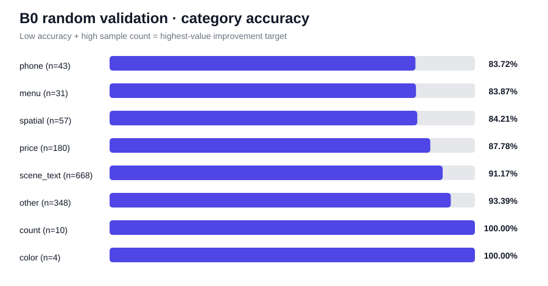

# Model Evolution

This file is the chronological modeling history of the project.

The goal is to make it possible to understand not only the final model, but **how and why the system improved**.

## Strategy flow



**Rule:** each arrow is earned by an ablation result. We do not skip directly to a more complex method without evidence.

## Current progression

| Stage | Model / pipeline | Single main change | Random acc. | Grouped acc. | Decision |
|---|---|---|---:|---:|---|
| **B0** | Qwen2.5-VL-3B-Instruct, direct prompt, ~0.8MP, free generation | Initial zero-shot baseline | **90.68%** | **91.73%** | Reference baseline |
| **A1** | Same model and resolution | direct → OCR-aware prompt | TBD | TBD | **Next** |
| A2 | Same winning prompt | standard → high resolution | TBD | TBD | Pending |
| A3 | Same winning prompt | resolution sensitivity check | TBD | TBD | Pending |
| A4 | Best prompt/resolution | free generation → constrained choice scoring | TBD | TBD | Pending |
| A5 | Best VLM setup | add external OCR | TBD | TBD | Conditional |
| A6 | Best inference setup | zero-shot → QLoRA | TBD | TBD | Conditional |

## B0 — Zero-shot reference

### One-screen summary

| Item | Result |
|---|---|
| Model | **Qwen2.5-VL-3B-Instruct** |
| Competition-data training | None |
| Prompt | Direct |
| Max image scale | ~0.8MP |
| Random accuracy | **90.68%** |
| Grouped accuracy | **91.73%** |
| OCR-heavy random accuracy | **89.91%** |
| Parse failures | **0** |
| Main finding | 74.4% of random-val errors are OCR-heavy |
| Decision | Keep as reference |
| Next | A1 OCR-aware prompt |





### Why this model

- Already available locally.
- 3B scale is practical on RTX 5060 Ti 16GB.
- Supports multimodal instruction following.
- Lets us measure pretrained OCR/VQA ability before task-specific tuning.

### Strategy

Use a minimal direct multiple-choice prompt with standard dynamic resolution (~0.8MP max) and no quantization.

No competition-data fine-tuning was used.

### Main finding

The baseline is already strong, but OCR-heavy categories contain **93 of the 125 random-validation errors (74.4%)**.

Therefore the next improvement target is not generic model replacement. It is a controlled test of whether OCR-aware prompting can recover text-centric errors.

### Improvement

B0 is the first full baseline, so there is no previous score to improve upon.

### Decision

Keep B0 unchanged as the reference point for every subsequent ablation.

---

## How future improvements will be recorded

For each stage, this file will be updated with:

- exact model and pipeline
- exact component changed
- previous score → new score
- percentage-point delta
- category-level gains/losses
- sample-level wrong→right / right→wrong changes
- reason for adoption or rejection
- next modeling decision

The final portfolio should therefore show a traceable sequence:

```
strong zero-shot VLM
→ OCR-aware prompt
→ resolution optimization
→ constrained choice scoring
→ selective OCR if justified
→ QLoRA only if reasoning/binding remains the bottleneck
```

The goal is not to collect many techniques. The goal is to make every added component explainable.
