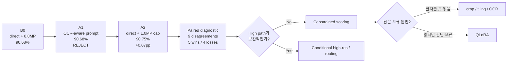
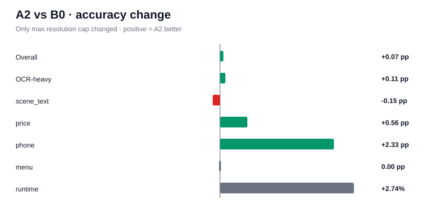

# Model Evolution

모델이 **어떻게, 왜 바뀌었는지**를 시간 순서대로 기록한다.

## 현재 전략 흐름



## 실험 진행표

| Stage | Pipeline | 한 가지 변경 | Random | Grouped | 결정 |
|---|---|---|---:|---:|---|
| **B0** | Qwen2.5-VL-3B + direct + ~0.8MP | baseline | **90.68%** | **91.73%** | 기준점 |
| **A1** | same + OCR-aware prompt | prompt | **90.68%** | 생략 | **Reject** |
| **A2** | same + ~1.0MP max cap | resolution cap | **90.75%** | 생략 | **보류/Reject as global** |
| **A2-D** | B0 vs A2 prediction comparison | no inference | **5 wins / 4 losses** | - | **High/ensemble 종료** |
| **A4** | B0 setup | constrained choice scoring | TBD | TBD | **Next** |
| **B1** | price+phone subset | binding-aware prompt | TBD | confirm only if pass | **Next** |
| B2 | layout-aware grounding | crop/bbox/OCR-layout | TBD | TBD | Conditional |
| A6 | best inference setup | QLoRA | TBD | TBD | Conditional |

## B0

- Model: **Qwen2.5-VL-3B-Instruct**
- direct prompt
- standard max ~0.8MP
- Random **90.68%**
- Grouped **91.73%**

## A1 — OCR-aware prompt

- Overall: **90.68% → 90.68%**
- OCR-heavy: **89.91% → 89.70%**
- Decision: **Reject**

프롬프트에서 OCR을 강조하는 것만으로는 개선되지 않았다.

## A2 — High max-resolution cap

- Overall: **90.68% → 90.75% (+0.07 pp)**
- Correct: **+1**
- OCR-heavy: **+0.11 pp**
- phone: **+2.33 pp**
- price: **+0.56 pp**
- scene_text: **-0.15 pp**
- Runtime: **+2.74%**



### 판단

**Global default로는 채택하지 않는다.**

+1문제는 실질적 개선이라고 보기 어렵다.

또한 max_pixels 증가 자체는 모든 이미지를 업스케일하지 않는다. 중앙 이미지 크기가 약 0.69MP이므로 standard 0.8MP cap 이하 이미지는 high 설정에서도 새 시각 정보가 생기지 않는다.

### 다음

새 GPU run 전에 **B0와 A2의 sample-level prediction 변화**를 분석한다.

목표는 high path가 단순 noise인지, 특정 샘플에서 상호보완적인지 판단하는 것이다.


## A2-D — Paired diagnostic

- Prediction disagreement: **9 / 1,341 (0.67%)**
- B0 wrong → A2 right: **5**
- B0 right → A2 wrong: **4**
- Net gain: **+1**
- Exact McNemar p-value: **1.00**
- Both wrong: **120**

바뀐 9개 prediction은 모두 OCR-heavy category였다.

### 판단

High cap은 global improvement도 아니고 ensemble partner로도 너무 유사하다.

다만 resolution이 일부 OCR-heavy sample에만 영향을 준다는 단서는 얻었다. 따라서 나중에 시각 정보를 더 쓰게 된다면 full-image high cap보다 **target crop / tiling / zoom**을 우선 검토한다.

### 다음

**A4 choice-scoring pre-check.** 먼저 a/b/c/d tokenization을 확인하고 올바른 scoring 구현을 선택한다.


## A4-P0 — Choice-token pre-check

Qwen tokenizer를 확인한 결과:

```text
a -> id 64
b -> id 65
c -> id 66
d -> id 67
```

assistant-generation context에서도 모두 **1 token**이다.

따라서 constrained choice scoring은 구현상 단순하다.

하지만 현재 greedy generation이 이미 모든 sample에서 정확히 한 글자 a/b/c/d를 출력한다면 next-token constrained scoring은 동일한 prediction을 만들 수밖에 없다.

### 다음

GPU run 전에 `raw_output` exact-one-letter 비율을 검사한다.

**전략:** scoring 기법을 구현할 수 있다는 이유만으로 실험하지 않는다. 실제로 prediction을 바꿀 가능성이 있는지 먼저 확인한다.


## A4-P1 — Generation-format diagnostic

B0 raw outputs:

- exact one-letter: **1,240 / 1,341 (92.47%)**
- non-exact: **101 / 1,341 (7.53%)**
- non-exact but choice-like: **101 / 101**
- parse failure: **0**

### 해석

Parser 문제는 아니다.

하지만 `(d)`처럼 첫 token이 괄호일 수 있는 101개에서는 constrained a/b/c/d logits가 현재 parsed answer와 달라질 가능성이 있다.

### 결정

전체 scoring run 전에 **101개 non-exact subset의 현재 accuracy/category를 CPU로 분석**한다.

그 subset이 실제로 취약하다면 그때 101개만 targeted scoring하여 정보 대비 GPU 비용을 최소화한다.


## A4-P2 — Exact vs non-exact accuracy

- exact one-letter: **1,240개, 90.08%, 123 errors**
- non-exact: **101개, 98.02%, 2 errors**
- 전체 오류 125개 중 **123개(98.4%)**가 exact output에서 발생

### 판단

Output formatting / parsing / constrained scoring은 핵심 병목이 아니다.

**A4 full scoring run은 생략한다.**

### 다음

B0의 125개 오류를 root cause로 분류한다.

결과에 따라:
- OCR recognition → crop/tiling/OCR
- localization → region-focused inference
- binding/reasoning → QLoRA
- mixed → routing

으로 분기한다.


## B0 root-cause review — 125/125 complete

가장 큰 failure cause:

1. **number_text_binding: 42 (33.6%)**
2. OCR recognition: 21
3. question understanding: 20
4. visual/spatial reasoning: 18
5. exact-string confusion: 13
6. target localization: 7
7. ambiguity/label: 4

Reasoning/association 계열(binding + question understanding + spatial)은 **80/125 = 64%**다.

### 전략 수정

초기에는 OCR-heavy dataset이므로 OCR 자체가 주 병목일 가능성을 의심했다.

하지만 prompt/resolution/scoring ablation과 수동 오류 분석을 합치면, 핵심은 **OCR recognition보다 target ↔ number/text binding과 reasoning**이다.

### 다음

**B1: price+phone selective binding-aware prompt.**

Random은 이제 반복 tuning에 사용된 dev set으로 보고, grouped는 candidate confirmation에만 사용한다.


## B1 — Selective binding-aware prompt

Target: **price + phone 223 samples**.

B0 on this subset:
- correct: **194**
- errors: **29**
- accuracy: **87.00%**

오답 root cause가 price 22/22, phone 7/7 모두 number/text binding이므로 prompt에서 OCR recognition이 아니라 **target ↔ value association**을 직접 지시한다.

### Gate

- Random subset **net +5 samples 이상** → grouped confirmation
- 그 미만 → prompt path 종료 후 layout-aware grounding(B2)

Random은 tuning/dev, grouped는 confirmation 용도로 유지한다.


## B1 result — binding-aware selective prompt

price+phone 223개에서:

- B0: **194/223 = 87.00%**
- B1: **196/223 = 87.89%**
- Wrong→Right: **2**
- Right→Wrong: **0**
- Net: **+2**
- McNemar exact p: **0.50**

사전 성공 기준 **net +5**에 미달하므로 B1은 채택하지 않는다.

다만 phone +1, price +1이라는 패턴이 A2 high-resolution과 aggregate 수준에서 동일하다.

### 다음

GPU를 쓰기 전에 **A2 vs B1 price+phone complementarity**를 확인한다.

같은 샘플을 고쳤다면 prompt/high-res branch를 닫고 B2 layout-aware grounding으로 이동한다.
서로 다른 샘플을 고쳤다면 두 intervention 조합 가능성을 작은 subset에서 검토한다.


## B1-D — A2 vs B1 complementarity

price+phone 223개에서 A2와 B1은 둘 다 **196/223 (87.89%)**였다.

하지만:
- A2-only correct: **2**
- B1-only correct: **2**
- both correct: **194**
- both wrong: **25**
- disagreement: **4/223 = 1.79%**

B0 대비 A2와 B1은 각각 +2, regression 0이었으므로 **각 intervention이 고친 2개가 서로 겹치지 않는다.**

### 다음

2×2 factorial의 마지막 cell을 채운다:

- standard/direct = B0
- high/direct = A2
- standard/binding = B1
- **high/binding = B1C (next)**

B1C가 **198/223 이상**이면 additive 가능성이 있어 grouped confirmation을 검토한다.
196 이하라면 prompt/high-resolution branch를 닫고 layout-aware grounding으로 이동한다.


## B1C — high + binding-aware

price+phone random subset에서:

- B0: **194/223**
- A2: **196/223**
- B1: **196/223**
- **B1C: 198/223 (88.79%)**

B0 대비:
- wrong→right **4**
- right→wrong **0**
- net **+4**
- McNemar exact p **0.125**

A2와 B1이 각각 고친 서로 다른 2개씩을 B1C가 모두 보존했다. 즉 이 subset에서는 두 intervention의 oracle union인 **198 correct**를 실제 결합 설정이 그대로 달성했다.

### 결정

사전 gate 198/223을 충족했으므로 **grouped confirmation 진행**.

Grouped B0 price+phone baseline은 **202/223**.

Confirmation gate:
- 206+ = strong replication
- 204–205 = directional replication
- 203 이하 = not confirmed


## B1C grouped confirmation

Grouped price+phone:
- B0: **202/223 = 90.58%**
- B1C: **205/223 = 91.93%**
- wins 6 / losses 3 / net **+3**
- McNemar p **0.508**

사전 gate상 **directional replication**이지만 stability warning이 발생했다.

Category:
- price: **+4 net** (166→170)
- phone: **-1 net** (36→35)

### 해석

B1C를 price+phone 전체에 적용하는 것은 채택하지 않는다.

Price는 random +2, grouped +4로 방향이 일관되고, phone은 random +2 / grouped -1로 불안정하다.

### 다음

Grouped 결과를 보고 price-only rule을 정제했기 때문에 바로 채택하지 않고 **fresh audit holdout**에서 마지막 독립 확인을 한다.

Random/grouped val ID를 모두 제외한 train pool에서 price 200 + phone 100을 고정 seed로 추출해 B0 vs B1C를 비교한다.


## Fresh audit split locked

After excluding all IDs used by random/grouped validation:

- remaining train pool: **4,294**
- price available: **570**
- phone available: **142**
- audit: **200 price + 100 phone = 300**

Decision rule is locked before inference:
- price net **+4 or more** with <=2 regressions → price-only routing candidate survives
- +2~3 → weak replication
- <=+1 → close routing branch

These 300 IDs are now reserved from future fine-tuning.
